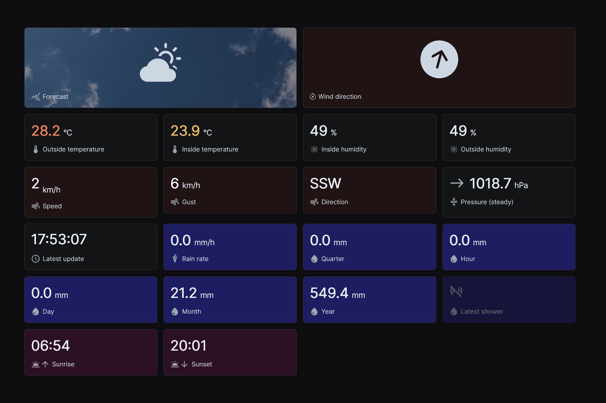
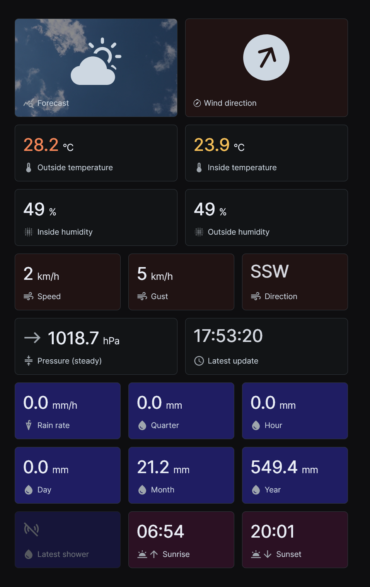
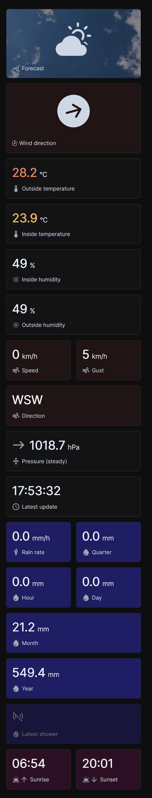

# vant-gui

Responsive web / desktop interface (a PWA) utilizing a running [vant-api](https://github.com/harrydehix/vant-api).

### ⚠️ Still in development!

The `vant-gui` is still in active development. It is recommended to wait until documentation and guides of a stable release are published.

# Screenshots

Even though the project is not finished yet a prototype is already working. Here are some screenshots:





All values are updated automatically in a configurable interval (default: `1s`).


# Running the prototype

### Prerequisites
- Running [vant-api](https://github.com/harrydehix/vant-api) prototype

To run the `vant-web-gui` prototype clone this package and define a `.env`-file in the root directory.
```env
REACT_APP_API_KEY=api-key-with-read-access      # the used api key to communicate with your vant-api
REACT_APP_API=http://localhost:8000/api         # the url to your vant-api
REACT_APP_RAIN_UNIT=mm                          # your desired rain unit (in, mm)
REACT_APP_WIND_UNIT=km/h                        # your desired wind unit (km/h, mph, Bft, ft/s, knots, m/s)
REACT_APP_TEMPERATURE_UNIT=°C                   # your desired temperature unit (°C, °F)
REACT_APP_SOLAR_RADIATION_UNIT=W/m²             # your desired solar radiation unit (W/m²)
REACT_APP_PRESSURE_UNIT=hPa                     # your desired pressure unit 
```

After that just execute `npm start` (development build) or `npm run build && serve -s build` (production build).
After changing the `.env` you always have to restart the application manually.